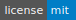

  
  <h3 align="center">PKit(Packet Kit)</h3>
  

    一个强大的跨平台底层数据包工具箱
     
    <a href="https://github.com/1uvu/pkit/issues/new?template=bug.md">Report bug</a>
    ·
    <a href="https://github.com/1uvu/pkit/issues/new?template=feature.md&labels=feature">Request feature</a>
  

---

## 目录

- [基本信息](#基本信息)
- [安装](#安装)
- [使用](#使用)
- [特性](#特性)
- [文档](#文档)
- [贡献和报告](#贡献和报告)
- [免责声明](#免责声明)
- [致谢](#致谢)
- [版权许可](#版权许可)

### 基本信息

---

Packet Kit 是一个网络数据包工具箱，包括捕获、过滤、解析、存储、构造、编辑、发送、统计、分析及安全描述等功能。它基于 Java 平台开发，使用 JavaFx 作为图形开发库，使用 Pcap4J 作为数据包捕获与过滤库，进一步地说，Pcap4J 基于 libpcap 和 npcap/winpcap。

目前阶段，Packet Kit 主要由三个模块构成：捕获、发送和分析，更多模块待日后添加

[最新发行版本](#)

### 安装

---

Packet Kit 已在以下平台进行过严格测试：

- Window 7+
- Linux（Ubuntu）

下载 jar 二进制文件，直接点击运行使用

注：需要 Java Jdk11+ 以及 libpcap 和 npcap/winpcap 环境支持

### 使用

---

**捕获模式**：

捕获模块分为两种模式：离线和在线，可读取离线数据包，也可实时捕获。

针对在线模式，还提供了捕获配置文件，可指定捕获数量、长度、延时及捕获模式等。

**发送模块**

发送模块也分为两种模式：发送和转发，可直接发送数据包，也可将数据包转发到其它的本地网卡。

发送的数据包既可以是自己构造的，也可以是导入的，既可以是原始包，也可以是修改之后的，既可以是单个包，也可以是包列表，还可以调整数据包列表的顺序。

还提供了发送配置文件，可指定发送数量、发送延迟及重试次数等。

**分析模块**

分析模块分为流量分析、通信状况、通联关系和安全描述四个方面，目前只支持对离线文件进行分析。

### 特性

---

**先这么吹着**

- 集百家之长：结合 wireshark、科来、xcap 等等工具的长处而设计
- 跨平台
- 可扩展
- 简单易用
- 功能强大

### 文档

---

**暂时没时间写，只列出大致的列表**

- 软件工程（需求分析、架构设计、系统设计）
- [项目结构](doc/project-structure.md)
- [代码规范](doc/code-structure.md)
- [使用文档](wiki)
- [待办清单](doc/todo.md)
- [已知 Bug](doc/bug.md)
- 等等

### 贡献和报告

---

**代码贡献**

有意贡献代码、完善项目，或者爱好 pcap、网络协议、java 开发的朋友，联系：mail:zjh98@vip.qq.com

**Bug 报告**

直接提 issue，如长时间不理，也可发邮件

### 免责声明

---

**你爱咋搞咋搞，和我没关系哈**

### 致谢

---

[@TCPDump.ORG](tcpdump.org)

[@WinPcap.ORG](winpcap.org)

[@Namp.ORG](namp.org)

[@Wireshark.ORG](wireshark.org)

[@Pcap4J.ORG](pcap4j.org)

[@OpenJFX.IO](openjfx.io)

[@HighCharts](https://www.highcharts.com.cn/)

### 版权许可

---

[MIT License](LICENSE.md)

禁止任何盈利使用和二次修改，转发务必带着本仓库的 [Entry](https://github.com/1uvu/PacketKit)

Enjoy it :metal: