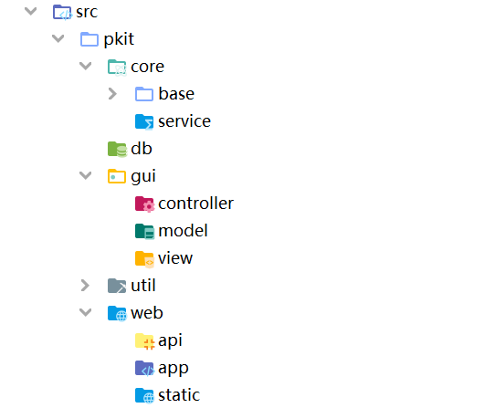
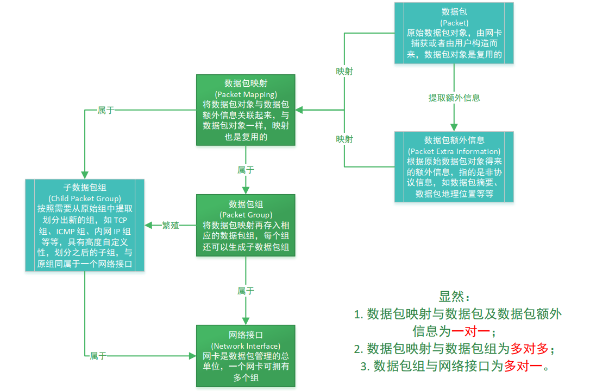
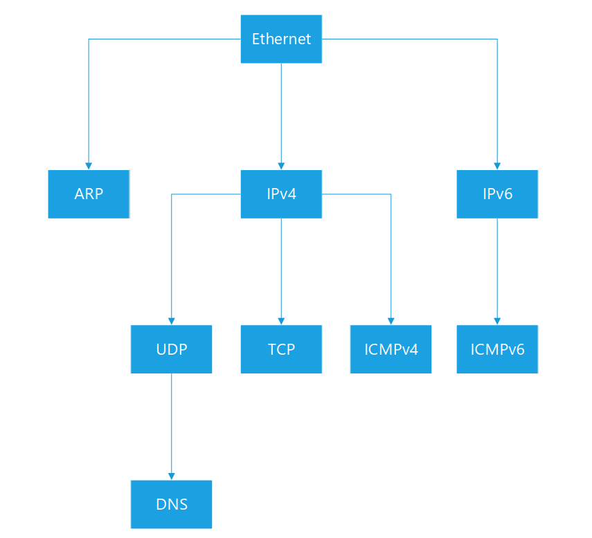

  
  <h3 align="center">PKit(Packet Kit)</h3>
  

    一个强大的跨平台底层数据包工具箱
     
    <a href="https://github.com/1uvu/pkit/issues/new?template=bug.md">Report bug</a>
    ·
    <a href="https://github.com/1uvu/pkit/issues/new?template=feature.md&labels=feature">Request feature</a>
  

---

## 目录

- [快速开始](#快速开始)
- [项目介绍](#项目介绍)
  - [需求](#需求)
  - [结构](#结构)
  - [技术栈](#技术栈)
  - [解决方案](#解决方案)
- [待办清单](#待办清单)
- [致谢](#致谢)
- [版权许可](#版权许可)

## 快速开始

**还没开发完哦**

## 项目介绍

#### 需求

本课题的目标是设计并开发一个网络数据包分析工具，基础是捕获过滤构造发送，关键是统计分析安全描述。

1. 数据包**捕获**与**过滤**：
   利用数据包捕获技术，支持捕获本地网络的底层数据包，且可对数据包进行过滤。
   - 捕获：可设置详细的捕获参数，例如是否尝试开启嗅探模式、监听模式，捕获延时，捕获缓冲区，捕获之后是否立即处理等等。
   - 过滤：可在捕获过程中实时地更新过滤器。
2. 数据包**构造**与**发送**：
   支持常用协议，如 ICMP、 ARP 等数据包的构造与发送，也可以直接修改并重放已捕获的数据包。
   - 构造：对于常用协议提供数据包模板，并支持修改部分内容，也可直接构造和重放，支持在重放之前修改部分内容。
   - 发送：可设置详细的发送参数，例如发送数量，发送延时，重试次数等等，还支持将数据包转发给本地的其它网卡。
3. 数据包**解析**及**存储**：
   可将捕获的数据包直接转储为通用格式的 pcap 文件，也可将对数据包解析之后得到的信息存入数据库。
   - 解析：解析是为了统计分析而服务，因此解析的内容不具有全面性，但具有针对性。
   - 存储：包括转储和解析后存储，同样是为了统计分析而服务。
4. 数据包**统计**与**分析**：
   支持对实时捕获到的数据包、离线 pcap 文件和数据库中的信息进行全方面的统计分析。
   - 流量分析：流量大小变化曲线图、  网卡信息、流量协议占比饼状图、 IPv4 及 IPv6 统计、 数据包统计、 流量统计。
   - 通信状况：主要为内网和外网以及内网之间通信状况，包括指定网段对其它网段访问的桑基图、 流量排行。
   - 通联关系：主要为IP 和 IP 以及 IP 和端口通联关系，包括所有 IP、 指定 IP 与其它 IP、 指定 IP 组与其他组（即子网与子网） 等等。
5. 网络环境**安全描述**：
   通过统计分析的结果来得到关于主机网络环境的准确安全描述。按照安全框架进行描述， 包括风险分析、 威胁分析、 异常点分析、 攻击行为分析等。

#### 结构

1. 首先，总体上分为两大部分：桌面客户端与 Web 应用。
   - 桌面客户端：为使用者提供各种操作的图形接口，实现了捕获、过滤、构造、发送的功能需求
   - Web 应用：为使用者提供了查看统计分析与描述结果的友好界面，实现了统计、分析、安全描述的功能需求。
2. 对于桌面客户端包括了底层功能模块与高级功能模块，这两个模块放置于 core 包，还包括图形界面模块，放置于 gui 包中。
3. 对于 Web 应用，放置于 web 包中。
4. 另外，还单独将工具模块放置在 util 包中。

结构如图：

#### 技术栈

项目开发用到的技术

1. 底层模块及高级模块：主要使用 Pcap4J
2. 图形界面模块：主要使用 JavaFX
3. Web 模块：使用 Spring Boot 结合 Vue.js 完成应用开发，使用 ECharts.js 完成绘图
4. 其它：除此之外还用到 MySQL 等技术

#### 解决方案

针对一些棘手问题的解决方案或回答

1. 对于交换环境，是否实现真正的嗅探？

   > 答：否，因为没有必要，而且，在交换环境下尝试监听其它设备的流量，这属于恶意行为，已经背离了开发此系统的初衷。

2. 是否有计划实现拦截本地数据包？

   > 答：否，因为技术上有瓶颈，而且，这样做会对本机的应用和数据带来危害。

3. 如何优雅地实现及控制捕获过程？

   > 答：我选择将捕获这一抽象的操作实例化为网络接口，因此捕获操作的实现就转化为网络接口对象及操作的实现；此外，为了更好地描述和控制捕获过程，我引入了网卡（网络接口）生命周期的概念，如下图，具体介绍可查看文档：[网卡生命周期](uml/网卡生命周期.pdf)

   

4. 如何实现捕获过程中实时地更新过滤器

   > 这是一个棘手的问题，为了解决它我使用了缓冲区的技术，而且将整个捕获过程分为两个子过程：
   >
   > 1）过程  a：过程 a 运行于捕获过程的始终，默认捕获全部数据包，将数据包放入磁盘缓冲区；捕获的同时对每个数据包应用当前的过滤器，将符合过滤规则的数据包送入其它流程，这就是过程 a，其实就是多了一个缓冲区的步骤。
   >
   > 2）过程 b：过程 b 运行于更新过滤器时，由于更新过滤器意味着需要刷新当前的数据包列表为最新的过滤结果，因此过程 b 的工作就是从缓冲区读取数据包，同时应用更新的过滤器，将满足的数据包送入其它流程，然后继续 a 过程。
   >
   > 简单的说就是：过程 a = 捕获+存储+过滤；过程 b = 读取+过滤。
   
5. 捕获或读取到的数据包列表如何高效地管理？

   > 答：这是一个承上启下的过程，为了扩展需要及其它模块的便利，必须对数据包进行高效地管理。因此，我引入了数据包组的概念，每个完整的数据包组都由在线数据包组和离线数据包组构成，顾名思义，在线组保存实时捕获的包，离线组保存从缓冲区或离线文件读取的包。
   >
   > 根据问题 4，可以举一个例子来说明这种组织方式的便利：
   >
   > 1）在线组接收根据实时捕获且通过过滤器的包，每当过滤器被更新时清空在线组；
   >
   > 2）离线组从捕获缓冲区读取包并对每个包应用过滤器，将通过过滤器的包存入离线组，每当过滤器被更新时更新离线组
   >
   > 3）离线组总是在在线组之前放入到完整的数据包组中
   >
   > 通过以上的逻辑就彻底实现了捕获与实时过滤时数据包列表的管理，十分方便。
   >
   > 另外，每个组还支持聚集、繁殖等操作，这些操作为其它模块提供了极大的便利。

6. 网络接口、数据包和数据包组之间的关系是怎样的？

   > 答：如下图，具体介绍可查看文档：[数据包、数据包组与网卡关系图](uml/数据包、数据包组与网卡关系图.pdf)

   

7. 捕获数据包协议的未知性问题如何解决？

   > 答：这同样是个棘手的问题，因为计算机网络体系结构是分层的，每一层协议都可能对应了很多种上层的协议，因此，整个体系结构就是一个十分庞大的协议树，真正解决这个问题只有一个办法：
   >
   > 1）优先实现通用及常用的协议：Ethernet、ARP、IPv4、IPv6、TCP、UDP、ICMPv4、ICMPv6、DNS 等
   >
   > 2）按照协议树的分支逻辑来处理每一个未知的数据包（此逻辑同样适用于数据包构造过程），初级的协议树如下图所示，具体介绍可查看文档：[协议树形图](uml/协议树形图.pdf)

   

8. 数据包解析及构造是如何实现的？如何缩小工作量？

   > 答：这个问题的出现体现了 Pcap4J 的一个弊端——封装性太好，导致代码的灵活性很低，因此为了减少工作量，我实现了一个新的数据包接口类及数据包处理类，并且在这个接口的基础上实现了常用、通用的多个协议数据包类，这些类都可用于解析并存储 Pcap 数据包的协议字段信息，同时也可根据需要修改这些字段，并能够直接使用这些字段构造数据包，可以通过几个应用场景的例子来说明这种结构的方便：
   >
   > 1）解析一个捕获的未知协议的数据包：
   >
   > - 数据包处理类的流水线判断数据包的协议类型选择不同的协议树分支
   > - 根据协议类型创建协议数据包类
   > - 协议数据包类解析并存储协议字段信息
   >
   > 2）构造一个数据包：
   >
   > - 数据包处理类的流水线根据数据包的协议类型选择不同的协议树分支
   > - 根据协议类型创建协议数据包类
   > - 协议数据包类初始化，加载默认字段，同时也可对字段进行修改
   > - 协议数据包类构造并创建 Pcap 数据包对象
   >
   > 3）重放一个数据包：
   >
   > - 数据包处理类的流水线判断数据包的协议类型选择不同的协议树分支
   > - 根据协议类型创建协议数据包类
   > - 可对字段进行修改
   > - 协议数据包类构造并创建 Pcap 数据包对象
   >
   > 可以看到，灵活性很不错

9. 更多解决方案介绍待续~

## 待办清单

- [x] Finished
  - [x] 网卡接口（interface）
  - [x] 数据包组接口（group）
  - [x] 接口、包、组关系设计
  - [x] 捕获、解析、构造思路文档
  - [x] 捕获网卡基础实现
  - [x] 配置文件接口及读写实现
  - [x] 捕获及缓冲区实现
  - [x] 基本完成捕获和发送类
  - [x] 数据包组接口定义
  - [x] 捕获数据包组实现
  - [x] 发送数据组实现
  - [x] 数据包额外信息类（部分，还剩描述没写完及小部分）
  - [x] 数据包构造类
  - [x] 发送数据组文件结构实现（json+目录）
- [ ] To do
  - [ ] 桌面客户端设计与开发
  - [ ] 数据包组聚集静态工具类（可视化时再写）

## 致谢

[@TCPDump.ORG](tcpdump.org)

[@WinPcap.ORG](winpcap.org)

[@Namp.ORG](namp.org)

[@Pcap4J.ORG](pcap4j.org)

[@OpenJFX.IO](openjfx.io)

[@Spring Projects](https://github.com/spring-projects/spring-boot)

[@Vue.js](https://vuejs.org/)

[@ECharts.js](https://www.echartsjs.com/)

## 版权许可

[MIT License](LICENSE.md)

Enjoy :metal: