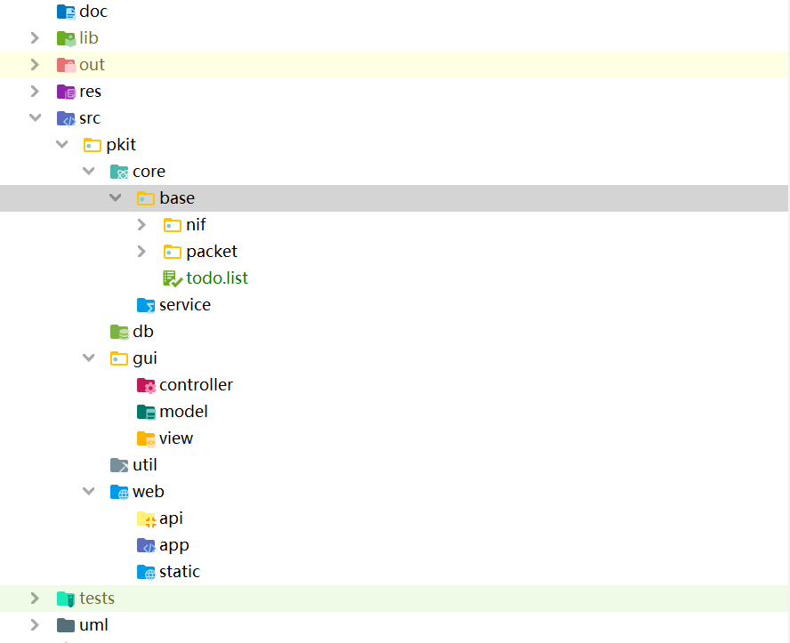

  
  <h3 align="center">PKit(Packet Kit)</h3>
  

    一个强大的跨平台底层数据包工具箱
     
    <a href="https://github.com/1uvu/pkit/issues/new?template=bug.md">Report bug</a>
    ·
    <a href="https://github.com/1uvu/pkit/issues/new?template=feature.md&labels=feature">Request feature</a>
  

---

## 目录

- [快速开始](#快速开始)
- [项目介绍](#项目介绍)
- [待办清单](#待办清单)
- [致谢](#致谢)
- [版权许可](#版权许可)

## 快速开始

Some text

- Instruction 1
- Instruction 2
- Instruction 3

## 项目介绍

#### 结构

## 待办清单

- [x] Finished
  - [x] 网卡接口（interface）
  - [x] 数据包组接口（group）
  - [x] 接口、包、组关系设计
  - [x] 捕获、解析、构造思路文档
  - [x] 捕获网卡基础实现
  - [x] 配置文件接口及读写实现
  - [x] 捕获及缓冲区实现
- [ ] To do
  - [ ] 基本完成捕获和发送网卡类，部分可先放着不管
  - [ ] 数据包组接口实现
  - [ ] 捕获和发送数据包组管理实现
  - [ ] 数据包操作类实现

## 致谢

Some Text

## 版权许可

Some Text

Enjoy :metal: